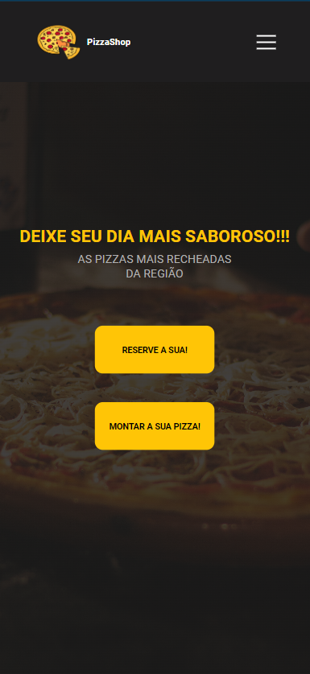
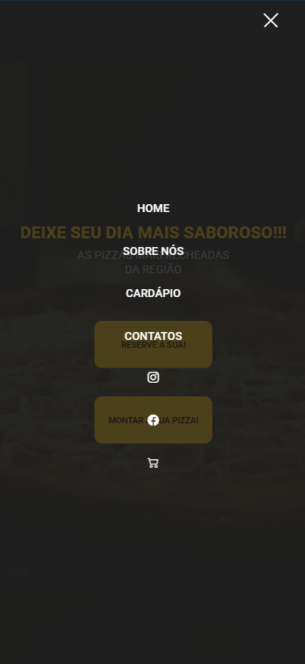

[HTML5]: https://img.shields.io/badge/html5-%23E34F26.svg?style=for-the-badge&logo=html5&logoColor=white
[CSS3]: https://img.shields.io/badge/css3-%231572B6.svg?style=for-the-badge&logo=css3&logoColor=white
[JavaScript]: https://img.shields.io/badge/javascript-%23323330.svg?style=for-the-badge&logo=javascript&logoColor=%23F7DF1E

<h1 align="center" style="font-weight: bold;">Landing Page - Pizzaria</h1>

![html5][HTML5]
![css][CSS3]
![javascript][JavaScript]

    <b>O projeto consiste em uma página web voltada para atrair clientes, gerar leads e aumentar as vendas no setor de restaurantes, pizzarias e lanchonetes. A página inclui uma seção com a descrição do estabelecimento e sua história, seguida por um cardápio prévio. Além disso, apresenta botões que direcionam o usuário para ações específicas, como reservar mesas ou montar e solicitar pedidos.
A página foi desenvolvida com foco na responsividade, adaptando-se a diferentes dispositivos e resoluções. Por exemplo, em smartphones, há um menu toggle — um menu oculto que pode ser acessado ao clicar em um ícone —, garantindo uma experiência limpa e organizada, sem sobrecarregar a interface com excesso de informações.</b>

<h2>🎨 Layout</h2>

    
    
    
    

<h2>🛠 Com o que foi construído?</h2>

A aplicação foi desenvolvida utilizando:

- HTML5 para a estruturação das páginas.
- CSS3 para estilização e design responsivo.
- JS para atualizações dinamicas em tempo real.

<h2>⁉ Por que foi feito?</h2>

O projeto integra um portfólio de landing pages e foi desenvolvido como um demonstrativo prático para empresários interessados em expandir seus negócios, destacando as oportunidades disponíveis nesse mercado. A página foi projetada com o objetivo de atrair clientes, gerar leads e impulsionar as vendas no segmento de restaurantes, pizzarias e lanchonetes.

